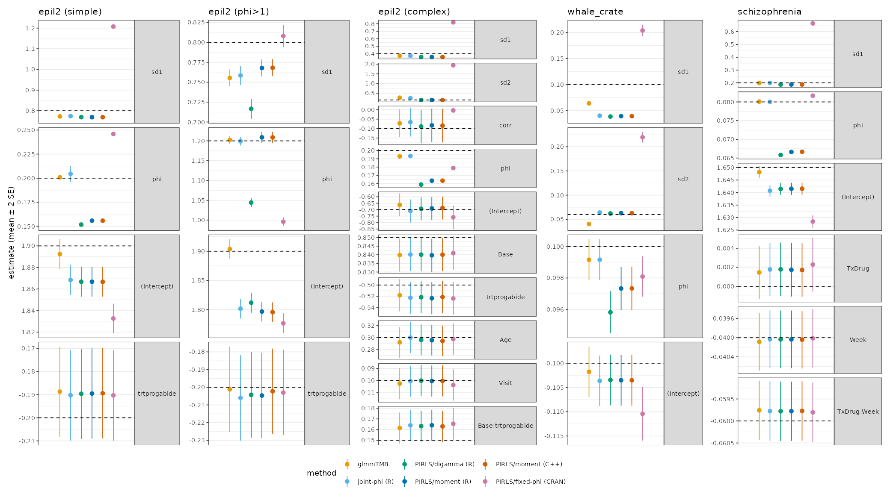
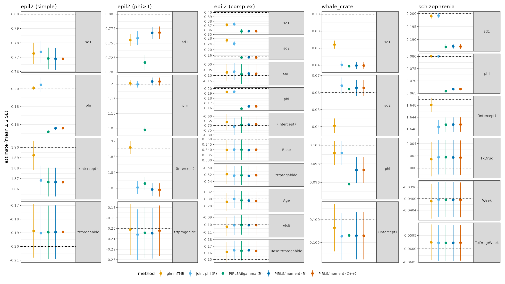
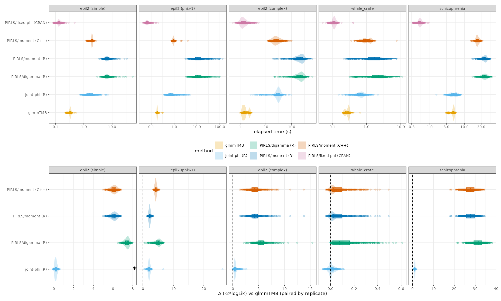

## tl;dr

We should definitely fix the current implementation of Gamma GLMMs in `lme4`. Should we choose an OK, computationally simple method, 
or a better, slightly faster method that would require more architectural changes?

## Overview

I've discovered some fairly fundamental, longstanding issues with fitting Gamma GLMMs (more 
precisely, fitting GLMMs with non-fixed/estimated dispersion parameters, $\phi$) in `lme4`.
The basic problem is that the PIRLS algorithm we've implemented assumes that we can keep
$\phi$ fixed at 1 while fitting the model and estimate it *post hoc* (e.g. as mean deviance per observation,
or the mean sum of squares of Pearson residuals). This first surfaced as a [GitHub issue](https://github.com/lme4/lme4/issues/643),
but the real problem was masked for a while by more trivial bugs ...

The current (CRAN/master branch) implementation often gives strongly biased estimates of random-effect SDs (upward, in the
examples I've looked at). The dispersion parameter $\phi$ is often biased --- 
in simple examples, upward when $\phi<1$ (Gamma less dispersed than exponential) and
downward when $\phi>1$, but this is not generally guaranteed. Luckily, the bias on fixed-effect estimates seems to be smaller
(since this is most what people most often care about). I haven't investigated the effects on confidence intervals/coverage.

There are a variety of ways of fixing this problem, with some tradeoffs.

* the simplest solution ("PIRLS/moment") is to implement a *nested* fixed-point loop with a moment estimate of $\phi$ (`wrss/n`). In the inner loop, we run PIRLS to convergence for
a fixed value of $\phi$; in the outer loop, we iterate the inner loop until $\phi$ converges.
* a slightly more complicated solution ("PIRLS/digamma") also uses a nested fixed-point loop, but uses a one-dimensional optimizer to find the MLE (similar to what `MASS:::gamma.shape.glm` does,
although the latter uses an explicit expression for the derivative and finds an iterative solution rather than calling `uniroot`)
* finally ("joint-phi"), we can add $\phi$ to the outermost, derivative-free optimization (e.g. via `bobyqa`) of the $\beta$ and $\theta$ parameters

In addition to the CRAN/master version of `lme4` (fixed-phi) and the PIRLS/moment method, which is implemented in C++ in the `Gamma_GLMM` branch of `lme4`, there is
a pure-R implementation of PIRLS/moment in `lme4pureR` (which, reassuringly, gives almost identical answers to the C++ implementation), as well as a PIRLS/digamma R implementation in `lme4pureR`. Finally, the joint-phi model is currently implemented only in a cobbled-together way (in `misc/Gamma_GLMM/paramsurvey/toolkit.R`), reimplementing the PIRLS loop from scratch.


## Evidence

It turns out that PIRLS/moment is much better than our current (wrong) solution, albeit slower, and straightforward to implement.
Surprisingly, PIRLS/digamma is actually worse than PIRLS/moment. Joint-phi is definitely best -- it matches `glmmTMB`, which for these purposes is
our gold standard, pretty well, and is not too slow --- **but** would require the largest architectural changes to the code. (We would need to make sure that everywhere
in the code that touched the parameter vector recognized that the vector was now $\{\theta, \beta, \phi\}$[^params].)[^nagq0]

[^params]: or, technically, $\{P, \beta, \phi\}$, where $P$-not-necessarily-equal-to-$\theta$ are the 'primitive' covariance parameters
[^nagq0]: Another open question is what we should do when `nAGQ=0`; do we then fall back to a cheaper/less correct approximation for $\phi$?

Other conclusions from Figures 1-3:

* `glmmTMB` usually, but not always, minimizes bias
* old/bad method usually biases $\phi$ toward 1. Other methods are either unbiased or bias $\phi$ downward
* in almost all cases, joint-phi gives very similar answers to `glmmTMB` (except for intercept estimates generally, and `sd1` and `sd2` for `whale_crate`). joint-phi neg-likelihood is closest to `glmmTMB` (which is lowest).
* `joint-phi` (implemented in R) is generally as fast as, or faster than, PIRLS/moment in C++; PIRLS/moment (R) is 2-12 times slower than PIRLS/moment (C++)

```{r sum-stderr, echo = FALSE}
#| fig-cap: "Parameter estimates from simulated examples (mean $\\pm$ 2SE), all methods (includes current/buggy CRAN version)"

```

```{r sum-stderr-newonly, echo = FALSE}
#| fig-cap: "Parameter estimates from simulated examples (mean $\\pm$ 2SE), omitting current/buggy CRAN version (to improve scaling/zoom in on better methods)"

```

```{r sum-stderr-time-negll, fig.caption="test3", echo = FALSE}
#| fig-cap: "Computation time and negative log-likelihood differences"

```

## Examples

Each example starts from a real data set. I fitted a model to the real data (regularizing
if necessary to avoid a singular fit); rounded the fitted parameters to 'pretty' values;
simulated new responses (randomizing both latent variables and the conditional distribution); and
fitted all six methods to each simulation set.

* epil2 (simple): uses `glmmTMB::epil2` (extended from `MASS::epil`, ultimately from @thallCovariance1990), but using a simplified model (`y ~ trt + (1 | subject)`) as used in [the GitHub issue](https://github.com/lme4/lme4/issues/643) (23/236 exact-zero values were dropped, for simplicity)
* epil2 ($\phi > 1$): as above, but setting $\phi = 1.2$ rather than 0.2 (as approximately derived from fitting the data). I wanted to explore at least one example with $\phi>1$, and it's surprisingly hard to find one in the wild:
* epil2 (complex): uses `y ~ Base * trt + Age + Visit + (Visit | subject)`, which is more realistic/closer to the model of interest for the original data set (haven't checked to see exactly what models @thallCovariance1990 fitted ...)
* whale_crate: this is a real data set from Tiago Marques (found [here](https://github.com/TiagoAMarques/Report4BB/)), on sperm whale cue rates (`crate ~ (1|location) + (1|fyear)`)
* schizophrenia: from `lme4`, model `imps79 ~ TxDrug * Week + (1 | id)`

## References
