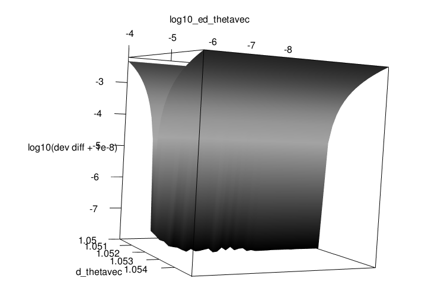

This explores a problem posted [on github](https://github.com/wch/lme4_error_example) and described in [this GitHub issue](https://github.com/lme4/lme4/issues/727), where running on Mac ARM64 throws an error but running under x86_64 emulation doesn't.

**tl;dr** this is a fairly unstable problem; it's absolutely standard that one gets slightly different results on different platforms, and when these results are on opposite sides of a tolerance boundary it can lead to the kind of difference you see here (i.e. some diagnostic metric is large enough to trigger an error or warning on one platform, and slightly smaller and hence just a little too small to trigger the warning on the other platform). You can probably work around this problem by changing the value of `devtol` when computing the confidence intervals; this argument controls the amount of deviation *below* the deviance of the fitted model (which should be the global minimum of the objective function, but isn't always) should be tolerated when fitting the profile.

What's below is admittedly a bit stream-of-consciousness.

```{r setup, include=FALSE}
knitr::opts_chunk$set(echo = TRUE)
```

```{r pkgs, message=FALSE}
library(lme4)
library(lmerTest)
library(glmmTMB)
library(nlme)
library(purrr)
library(dplyr)
library(ggplot2); theme_set(theme_bw())
```

```{r firstfit}
df <- read.csv("lme4_GH727.csv", header = TRUE)
model <- lmer(y ~ a + b + c + (1 | d/e), data = df)
summary(model, correlation = FALSE)  ## don't show correlation between fixed effects
```

**Notes**

- `lmerTest` gives a warning ("model failed to converge with 1 negative eigenvalue") while `lme4` by itself would not.
- the reported variance for the `1|e:d` term (derived from the nested term `(1|d/e)`) is not zero, but it's approximately 10 orders of magnitude smaller than the other variances in the problem (1e+2 vs 1e-8). Since the corresponding parameter (which is the standard deviation of the random effect scaled by the residual standard deviation is below the default tolerance for the singularity check (`lmerControl()$checkConv$check.conv.singular$tol`), the model is reported as being singular.

```{r comp_sing}
v <- c(sapply(VarCorr(model), sqrt), resid = sigma(model))
(th1 <- v[1:2]/v[["resid"]])
(th2 <- getME(model, "theta"))
all.equal(unname(th1), unname(th2))
(tol <- lmerControl()$checkConv$check.conv.singular$tol)
th2 < tol
```

Another relevant control parameter is `boundary.tol`; if the estimated parameter is less than this value, then `lmer` will also check the goodness-of-fit at the boundary (i.e. for a parameter value of zero). The default value is `r lmerControl()$boundary.tol`, which is *slightly* smaller than the estimated parameter value (`r getME(model, "theta")[1]`), so this check is not done by default (on this platform). We can set it a bit larger to trigger the check:

```{r boundary.tol}
model2 <- update(model, control = lmerControl(boundary.tol = 1e-3))
cbind(orig = getME(model, "theta"), boundary.tol = getME(model2, "theta"))
```

Conveniently, this difference in the boundary-checking tolerance is also enough to trigger the error that was seen on arm64. Since later checks established that the problem lies in the profile for the first parameter (the `1|e:d` variance), we'll save a little bit of time by only getting that confidence interval:

```{r ci1, cache = TRUE}
## oldNames = FALSE gives slightly more interpretable names
(cc1 <- confint(model, oldNames = FALSE, parm = 1))
```

```{r ci2}
try(confint(model2, oldNames = FALSE, parm = 1))
```

We could work around this by passing a larger value of `devtol`:

```{r ci2B, cache = TRUE}
(cc2 <- confint(model2, oldNames = FALSE, parm = 1, devtol = 1e-7))
```

The results are practically the same.

What's going on here? Can we look in a little more detail?

```{r profs, cache = TRUE, warning = FALSE}
prof1 <- profile(model, which = 1, signames = FALSE, devtol = 1e-7)
prof1B <- profile(model, which = 1, signames = FALSE, devtol = 1e-7, delta = 1e-4)
prof2 <- profile(model2, which = 1, signames = FALSE, devtol = 1e-7)
prof2B <- profile(model2, which = 1, signames = FALSE, devtol = 1e-7, delta = 1e-4)
prof_all <- lme4:::namedList(prof1, prof1B, prof2, prof2B) |>
    purrr::map_dfr(as.data.frame, .id = "id")
```

The evaluation of the profile gets very noisy near the boundary:

```{r plot_profs, warning = FALSE}
print(gg_prof1 <- ggplot(prof_all, aes(.focal, .zeta, colour = id)) +
    geom_point(aes(shape=id)) + geom_line(aes(linetype=id)) +
    scale_x_log10() +
     scale_y_log10()
)
```

What about with other packages?

```{r other_pkgs, cache = TRUE}
model3 <- glmmTMB(y ~ a + b + c + (1 | d/e), data = df, REML = TRUE)
model4 <- lme(y ~ a + b + c, random = ~1 | d/e, data = na.omit(df))
c(glmmTMB = VarCorr(model3)$cond[["e:d"]],
  lme = as.numeric(VarCorr(model4)[4,1]), ## ugh
  lmer.boundcheck = VarCorr(model2)[["e:d"]],
  lmer.default = VarCorr(model)[["e:d"]])
nll <- -1*c(glmmTMB = logLik(model3),
            lme = logLik(model4),
            lmer.boundcheck = logLik(model2),
            lmer.default = logLik(model))
nll - min(nll)            
```

```{r glmmTMB_prof, cache=TRUE}
model3B <- update(model3, REML = FALSE)
## can't compute profiles for REML models ...
prof3 <- profile(model3B, parm = 6, stderr=1, npts = 51)
```

Combine with other profile info (glmmTMB profile is not quite right - REML vs ML):

```{r prof_allx, warning = FALSE}
prof_allx <- dplyr::bind_rows(prof_all,
                       transmute(prof3,
                                 id = "prof3",
                                 .focal = exp(.focal),
                                 .zeta = sqrt(value)))
gg_prof1 %+% prof_allx +
    scale_x_log10(limits=c(1e-8, NA))
```

(How much do `d` and `d:e` overlap? There are 9523 unique values
of `d` and 9530 values of `d:e`, makes me worry that these are almost
identical/very little resolution)

It does seem, though, that the inclusion of the `1|d/e` term is warranted:

```{r otherfits, cache = TRUE}
model5 <- lmer(y ~ a + b + c + (1 | d), data = df)
model6 <- lmer(y ~ a + b + c + (1 | d:e), data = df)
nll <- -1*sapply(list(nested = model, d_only = model5, de_only = model6), logLik)
nll - min(nll)
```

What about the likelihood surface?  This is reasonably straightforward because everything
except the two random-effect variance parameters is profiled out:

```{r liksurf}
ff <- getME(model, "devfun")
all.equal(ff(getME(model, "theta")), -2*c(logLik(model)))
log10_ed_thetavec <- seq(-8, -4, length = 41)
d_thetavec <- seq(1.05, 1.055, length = 31)
res <- matrix(NA_real_, nrow = 41, ncol = 31,
              dimnames = list(ed = log10_ed_thetavec,
                              d = d_thetavec))
for (i in seq_along(log10_ed_thetavec)) {
    for (j in seq_along(d_thetavec)) {
        res[i,j] <- ff(c(10^log10_ed_thetavec[i], d_thetavec[j]))
    }
}
res2 <- as.data.frame.table(res) |>
    mutate(across(c(ed, d), ~ as.numeric(as.character(.))),
           d_nll = Freq - min(Freq))
ggplot(res2, aes(x = ed, y = d)) +
    geom_raster(aes(fill = d_nll)) +
    scale_fill_viridis_c(trans = "log10")

if (FALSE) {
    library(rgl)
    um <- structure(c(-0.887270092964172, 0.0243131145834923, 0.460609048604965, 
                      0, 0.457728624343872, -0.076750248670578, 0.885773062705994, 
                      0, 0.0568877384066582, 0.996753692626953, 0.0569693520665169, 
                      0, 0, 0, 0, 1), dim = c(4L, 4L))
    par3d(userMatrix = um)
    persp3d(log10_ed_thetavec, d_thetavec, log10(res-min(res)+1e-8), col = "gray", specular = "white", zlab = "log10(dev diff + 1e-8)")
    
    ## rgl.snapshot("rgl.png")e
}
```



---

```{r si}
sessionInfo()
```
